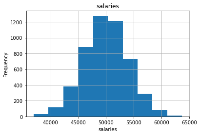
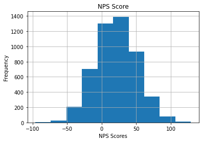
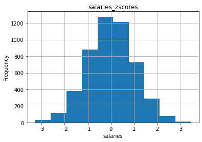
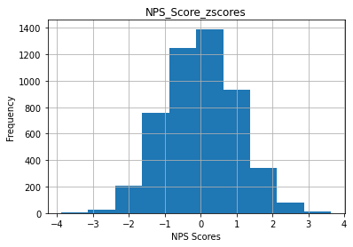
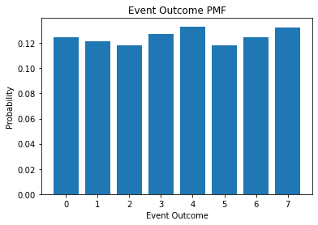
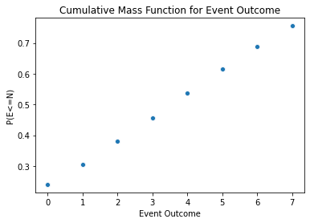

# Objectives
YW
* scrape a website for relevant information, store that information to a dataframe and save that dataframe as a csv file
* load in a dataframe and do the following
    * calculate the zscores of a given column
    * calculate the zscores of a point from a given column in the dataframe
    * calculate and plot the pmf and cdf of another column

# Part 1 - Webscraping
* use the following url scrape the first page of results
* for each item get the name of the item
* store the names to a dataframe and save that dataframe to csv then display
    * store the dataframe in the `data` folder in the repo
    * name the file `part1.csv` and make sure that when you write it you set `index=False`
* the head of the dataframe

* it should match the following


```python
# scrape the data
import json
import requests

import pandas as pd
from bs4 import BeautifulSoup
from pymongo import MongoClient
```


```python
url = "https://www.petsmart.com/dog/treats/dental-treats/#page_name=flyout&category=dog&cta=dentaltreat"
```


```python
r=requests.get(url=url)
r.status_code
```


    200


```python
r.content[:3000]
```


    b'\n<!doctype html>\n<!--[if lt IE 7]> <html class="ie6 oldie" lang="en"> <![endif]-->\n<!--[if IE 7]> <html class="ie7 oldie" lang="en"> <![endif]-->\n<!--[if IE 8]> <html class="ie8 oldie" lang="en"> <![endif]-->\n<!--[if gt IE 8]><!--> <html lang="en"> <!--<![endif]-->\n<head>\n<script>\ndataLayer =\n[{\n\'language\': \'en\',\n\'loginState\': false,\n\'pageName\':\'ps:\'productgridutils.getfirstparentname(pdict.productsearchresult.category):productgridutils.getsecondparentname(pdict.productsearchresult.category):dental-treats\',\n\'section\': \'productgridutils.getsecondparentname(pdict.productsearchresult.category)\',\n\'subSection\': \'productgridutils.getfirstparentname(pdict.productsearchresult.category)\',\n\n\n\n}];\n</script>\n\n<script>(function(w,d,s,l,i){w[l]=w[l]||[];w[l].push({\'gtm.start\':\nnew Date().getTime(),event:\'gtm.js\'});var f=d.getElementsByTagName(s)[0],\nj=d.createElement(s),dl=l!=\'dataLayer\'?\'&l=\'+l:\'\';j.async=true;j.src=\n\'//www.googletagmanager.com/gtm.js?id=\'+i+dl;f.parentNode.insertBefore(j,f);\n})(window,document,\'script\',\'dataLayer\',\'GTM-NGQNND\');</script>\n\n\n<style>\n.cookie-policy-button {display: none !important;}\n</style>\n<meta charset=UTF-8>\n<meta property="og:image" content="https://s7d2.scene7.com/is/image/PetSmart/petsmart-logo" />\n<meta http-equiv="x-ua-compatible" content="ie=edge">\n<meta name="viewport" content="width=device-width, initial-scale=1">\n<meta name="format-detection" content="telephone=no">\n<meta http-equiv="Content-Security-Policy" content="upgrade-insecure-requests">\n<title>\n\nDog Dental Treats: Healthy Dog Treats | PetSmart\n\n</title>\n<link href="https://www.petsmart.com/on/demandware.static/Sites-PetSmart-Site/-/default/dw2d8cf1c8/images/favicon-petsmart.ico" rel="shortcut icon" />\n<meta name="description" content="Dog dental treats are healthy for teeth and gums. Along with regular brushing, dental treats remove plaque to keep your dog\'s mouth clean and fresh!" />\n<meta name="keywords" content="dog dental treats, dental treats, healthy dog treats" />\n<script type="text/javascript">//<!--\n/* <![CDATA[ (head-active_data.js) */\nvar dw = (window.dw || {});\ndw.ac = {\n    _analytics: null,\n    _events: [],\n    _category: "",\n    _searchData: "",\n    _anact: "",\n    _anact_nohit_tag: "",\n    _capture: function(configs) {\n        if (Object.prototype.toString.call(configs) === "[object Array]") {\n            configs.forEach(captureObject);\n            return;\n        }\n        dw.ac._events.push(configs);\n    },\n\tcapture: function() { \n\t\tdw.ac._capture(arguments);\n\t\t// send to CQ as well:\n\t\tif (window.CQuotient) {\n\t\t\twindow.CQuotient.trackEventsFromAC(arguments);\n\t\t}\n\t},\n    EV_PRD_SEARCHHIT: "searchhit",\n    EV_PRD_DETAIL: "detail",\n    EV_PRD_RECOMMENDATION: "recommendation",\n    EV_PRD_SETPRODUCT: "setproduct",\n    applyContext: function(context) {\n        if (typeof context === "object" && context.hasOwnProperty("category")) {\n        \tdw.ac._category = context.category;\n        }\n        if (typeof context === "object" && context.hasOwnPro'


```python
webpage_soup = BeautifulSoup(r.content,'html.parser')
```


```python
results_list = webpage_soup.find_all('div', attrs={'class': 'search-result-content'})
results = results_list[0]
```


```python
result_boxes = results.find_all('li', attrs={'class': 'grid-tile col-md-4 col-sm-12'})
len(result_boxes)
```


    36


```python
first_box = result_boxes[0]
name = first_box.find('h3').text
name
```


    'Greenies Regular Dental Dog Treats'


```python
name_list = []
for box in result_boxes:
    name_list.append(box.find('h3').text)
name_list
```


    ['Greenies Regular Dental Dog Treats',
     'Greenies Petite Dental Dog Treats',
     'Greenies Large Dental Dog Treats',
     'Pedigree Dentastix Large Dog Treats',
     'Greenies 6 Month+ Puppy Petite Dental Dog Treats',
     'Greenies 6 Month+ Puppy Dental Dog Treats',
     'Greenies 6 Month+ Puppy Teenie Dental Dog Treats',
     'Greenies Teenie Dental Dog Treats',
     'Authority® Dental & DHA Stick Puppy Treats Parsley Mint - Gluten Free, Grain Free',
     'Pedigree Dentastix Large Dog Sticks',
     'Milk-Bone Brushing Chews Large Dental Dog Treats',
     'Pedigree Dentastix Triple Action Dental Dog Treats - Variety Pack',
     'Pedigree Dentastix Small/Medium Dog Sticks',
     'WHIMZEES Variety Value Box Dental Dog Treat - Natural, Grain Free',
     'Pedigree Dentastix Mini Dog Sticks',
     'Virbac® C.E.T.® VeggieDent® Tartar Control Dog Chews',
     'Milk-Bone Brushing Chews Dental Dog Treat',
     'Authority® Dental & DHA Rings Puppy Treats Parsley Mint - Gluten Free, Grain Free',
     'Pedigree Dentastix Large Dog Sticks',
     'Greenies Teenie Dog Dental Treats - Blueberry',
     'Pedigree Dentastix Triple Action Small Dog Treats - Fresh',
     'Milk-Bone Brushing Chew Mini Dental Dog Treats',
     'Authority Dental & Multivitamin Large Dog Treats Parsley Mint - Gluten Free, Grain Free',
     'Greenies Aging Care Dental Dog Treats, 27 oz',
     'Authority® Dental & Multivitamin Medium Dog Treats Parsley Mint - Gluten Free, Grain Free',
     'Authority Dental & Multivitamin Small Dog Treats Parsley Mint - Gluten Free, Grain Free',
     'Greenies Regular Dog Dental Treats - Blueberry',
     'Merrick® Fresh Kisses™ Double-Brush Large Dental Dog Treat - Mint Breath Strips',
     'Blue Buffalo Dental Bones Large Dog Treats - Natural',
     'WHIMZEES Brushzees Extra Small Dental Dog Treat - Natural, Grain Free',
     'Greenies Petite Dental Dog Treats - Blueberry',
     'Greenies Grain Free Teenie Dental Dog Treats',
     'Pedigree Dentastix Dual Flavor Large Dental Dog Treats',
     'Greenies Teenie Dental Dog Treats - Fresh',
     'Merrick® Fresh Kisses™ Double-Brush Small Dental Dog Treat - Mint Breath Strips',
     'WHIMZEES Brushzees Medium Dental Dog Treat - Natural, Grain Free']


```python
# load the data into a dataframe file
df = pd.DataFrame(name_list)
df
```


<div>
<style scoped>
    .dataframe tbody tr th:only-of-type {
        vertical-align: middle;
    }

    .dataframe tbody tr th {
        vertical-align: top;
    }

    .dataframe thead th {
        text-align: right;
    }
</style>
<table border="1" class="dataframe">
  <thead>
    <tr style="text-align: right;">
      <th></th>
      <th>0</th>
    </tr>
  </thead>
  <tbody>
    <tr>
      <td>0</td>
      <td>Greenies Regular Dental Dog Treats</td>
    </tr>
    <tr>
      <td>1</td>
      <td>Greenies Petite Dental Dog Treats</td>
    </tr>
    <tr>
      <td>2</td>
      <td>Greenies Large Dental Dog Treats</td>
    </tr>
    <tr>
      <td>3</td>
      <td>Pedigree Dentastix Large Dog Treats</td>
    </tr>
    <tr>
      <td>4</td>
      <td>Greenies 6 Month+ Puppy Petite Dental Dog Treats</td>
    </tr>
    <tr>
      <td>5</td>
      <td>Greenies 6 Month+ Puppy Dental Dog Treats</td>
    </tr>
    <tr>
      <td>6</td>
      <td>Greenies 6 Month+ Puppy Teenie Dental Dog Treats</td>
    </tr>
    <tr>
      <td>7</td>
      <td>Greenies Teenie Dental Dog Treats</td>
    </tr>
    <tr>
      <td>8</td>
      <td>Authority® Dental &amp; DHA Stick Puppy Treats Par...</td>
    </tr>
    <tr>
      <td>9</td>
      <td>Pedigree Dentastix Large Dog Sticks</td>
    </tr>
    <tr>
      <td>10</td>
      <td>Milk-Bone Brushing Chews Large Dental Dog Treats</td>
    </tr>
    <tr>
      <td>11</td>
      <td>Pedigree Dentastix Triple Action Dental Dog Tr...</td>
    </tr>
    <tr>
      <td>12</td>
      <td>Pedigree Dentastix Small/Medium Dog Sticks</td>
    </tr>
    <tr>
      <td>13</td>
      <td>WHIMZEES Variety Value Box Dental Dog Treat - ...</td>
    </tr>
    <tr>
      <td>14</td>
      <td>Pedigree Dentastix Mini Dog Sticks</td>
    </tr>
    <tr>
      <td>15</td>
      <td>Virbac® C.E.T.® VeggieDent® Tartar Control Dog...</td>
    </tr>
    <tr>
      <td>16</td>
      <td>Milk-Bone Brushing Chews Dental Dog Treat</td>
    </tr>
    <tr>
      <td>17</td>
      <td>Authority® Dental &amp; DHA Rings Puppy Treats Par...</td>
    </tr>
    <tr>
      <td>18</td>
      <td>Pedigree Dentastix Large Dog Sticks</td>
    </tr>
    <tr>
      <td>19</td>
      <td>Greenies Teenie Dog Dental Treats - Blueberry</td>
    </tr>
    <tr>
      <td>20</td>
      <td>Pedigree Dentastix Triple Action Small Dog Tre...</td>
    </tr>
    <tr>
      <td>21</td>
      <td>Milk-Bone Brushing Chew Mini Dental Dog Treats</td>
    </tr>
    <tr>
      <td>22</td>
      <td>Authority Dental &amp; Multivitamin Large Dog Trea...</td>
    </tr>
    <tr>
      <td>23</td>
      <td>Greenies Aging Care Dental Dog Treats, 27 oz</td>
    </tr>
    <tr>
      <td>24</td>
      <td>Authority® Dental &amp; Multivitamin Medium Dog Tr...</td>
    </tr>
    <tr>
      <td>25</td>
      <td>Authority Dental &amp; Multivitamin Small Dog Trea...</td>
    </tr>
    <tr>
      <td>26</td>
      <td>Greenies Regular Dog Dental Treats - Blueberry</td>
    </tr>
    <tr>
      <td>27</td>
      <td>Merrick® Fresh Kisses™ Double-Brush Large Dent...</td>
    </tr>
    <tr>
      <td>28</td>
      <td>Blue Buffalo Dental Bones Large Dog Treats - N...</td>
    </tr>
    <tr>
      <td>29</td>
      <td>WHIMZEES Brushzees Extra Small Dental Dog Trea...</td>
    </tr>
    <tr>
      <td>30</td>
      <td>Greenies Petite Dental Dog Treats - Blueberry</td>
    </tr>
    <tr>
      <td>31</td>
      <td>Greenies Grain Free Teenie Dental Dog Treats</td>
    </tr>
    <tr>
      <td>32</td>
      <td>Pedigree Dentastix Dual Flavor Large Dental Do...</td>
    </tr>
    <tr>
      <td>33</td>
      <td>Greenies Teenie Dental Dog Treats - Fresh</td>
    </tr>
    <tr>
      <td>34</td>
      <td>Merrick® Fresh Kisses™ Double-Brush Small Dent...</td>
    </tr>
    <tr>
      <td>35</td>
      <td>WHIMZEES Brushzees Medium Dental Dog Treat - N...</td>
    </tr>
  </tbody>
</table>
</div>


```python
# save the data as a csv file
df.to_csv("data/part1.csv",index=False)
```


```python
# display df.head()
df.head()
```


<div>
<style scoped>
    .dataframe tbody tr th:only-of-type {
        vertical-align: middle;
    }

    .dataframe tbody tr th {
        vertical-align: top;
    }

    .dataframe thead th {
        text-align: right;
    }
</style>
<table border="1" class="dataframe">
  <thead>
    <tr style="text-align: right;">
      <th></th>
      <th>0</th>
    </tr>
  </thead>
  <tbody>
    <tr>
      <td>0</td>
      <td>Greenies Regular Dental Dog Treats</td>
    </tr>
    <tr>
      <td>1</td>
      <td>Greenies Petite Dental Dog Treats</td>
    </tr>
    <tr>
      <td>2</td>
      <td>Greenies Large Dental Dog Treats</td>
    </tr>
    <tr>
      <td>3</td>
      <td>Pedigree Dentastix Large Dog Treats</td>
    </tr>
    <tr>
      <td>4</td>
      <td>Greenies 6 Month+ Puppy Petite Dental Dog Treats</td>
    </tr>
  </tbody>
</table>
</div>


# Part 2

load in the csv file located in the `data` folder called `part2.csv`

create a function that calculates the zscores of an array

then calculate the zscores for each column in part2.csv and add them as columns

See below for final result


```python
df2 = pd.read_csv('data/part2.csv')
df2
```


<div>
<style scoped>
    .dataframe tbody tr th:only-of-type {
        vertical-align: middle;
    }

    .dataframe tbody tr th {
        vertical-align: top;
    }

    .dataframe thead th {
        text-align: right;
    }
</style>
<table border="1" class="dataframe">
  <thead>
    <tr style="text-align: right;">
      <th></th>
      <th>salaries</th>
      <th>NPS Score</th>
      <th>eventOutcome</th>
    </tr>
  </thead>
  <tbody>
    <tr>
      <td>0</td>
      <td>44112.0</td>
      <td>-7.0</td>
      <td>1</td>
    </tr>
    <tr>
      <td>1</td>
      <td>46777.0</td>
      <td>-12.0</td>
      <td>2</td>
    </tr>
    <tr>
      <td>2</td>
      <td>50013.0</td>
      <td>50.0</td>
      <td>5</td>
    </tr>
    <tr>
      <td>3</td>
      <td>48983.0</td>
      <td>-13.0</td>
      <td>0</td>
    </tr>
    <tr>
      <td>4</td>
      <td>50751.0</td>
      <td>-11.0</td>
      <td>6</td>
    </tr>
    <tr>
      <td>...</td>
      <td>...</td>
      <td>...</td>
      <td>...</td>
    </tr>
    <tr>
      <td>4995</td>
      <td>50580.0</td>
      <td>62.0</td>
      <td>7</td>
    </tr>
    <tr>
      <td>4996</td>
      <td>54526.0</td>
      <td>10.0</td>
      <td>1</td>
    </tr>
    <tr>
      <td>4997</td>
      <td>46135.0</td>
      <td>-27.0</td>
      <td>3</td>
    </tr>
    <tr>
      <td>4998</td>
      <td>47223.0</td>
      <td>3.0</td>
      <td>7</td>
    </tr>
    <tr>
      <td>4999</td>
      <td>47913.0</td>
      <td>2.0</td>
      <td>0</td>
    </tr>
  </tbody>
</table>
<p>5000 rows × 3 columns</p>
</div>


```python
import numpy as np
import scipy.stats as scs
salaries_array=np.asarray(df2['salaries'])
NPS_array=np.asarray(df2['NPS Score'])
eventOutcome_array=np.asarray(df2['eventOutcome'])
salaries_array, NPS_array, eventOutcome_array
```


    (array([44112., 46777., 50013., ..., 46135., 47223., 47913.]),
     array([ -7., -12.,  50., ..., -27.,   3.,   2.]),
     array([1, 2, 5, ..., 3, 7, 0], dtype=int64))


```python
# calculate the zscore for each column and store them as a new column with the names used above
salaries_z = stats.zscore(salaries_array)
NPS_z = stats.zscore(NPS_array)
eo_z = stats.zscore(eventOutcome_array)
salaries_z, NPS_z, eo_z
```


    (array([-1.46030067, -0.7940606 ,  0.01492733, ..., -0.95455821,
            -0.68256227, -0.51006484]),
     array([-0.91361296, -1.08077601,  0.99204586, ..., -1.58226517,
            -0.57928685, -0.61271946]),
     array([-1.10327636, -0.66816185,  0.6371817 , ..., -0.23304733,
             1.50741072, -1.53839088]))


```python
df2['salaries_zscores'] = salaries_z
df2['NPS_Score_zscores'] = NPS_z
df2['eventOutcome_zscores'] = eo_z
df2.head()
```


<div>
<style scoped>
    .dataframe tbody tr th:only-of-type {
        vertical-align: middle;
    }

    .dataframe tbody tr th {
        vertical-align: top;
    }

    .dataframe thead th {
        text-align: right;
    }
</style>
<table border="1" class="dataframe">
  <thead>
    <tr style="text-align: right;">
      <th></th>
      <th>salaries</th>
      <th>NPS Score</th>
      <th>eventOutcome</th>
      <th>salaries_zscores</th>
      <th>NPS_Score_zscores</th>
      <th>eventOutcome_zscores</th>
    </tr>
  </thead>
  <tbody>
    <tr>
      <td>0</td>
      <td>44112.0</td>
      <td>-7.0</td>
      <td>1</td>
      <td>-1.460301</td>
      <td>-0.913613</td>
      <td>-1.103276</td>
    </tr>
    <tr>
      <td>1</td>
      <td>46777.0</td>
      <td>-12.0</td>
      <td>2</td>
      <td>-0.794061</td>
      <td>-1.080776</td>
      <td>-0.668162</td>
    </tr>
    <tr>
      <td>2</td>
      <td>50013.0</td>
      <td>50.0</td>
      <td>5</td>
      <td>0.014927</td>
      <td>0.992046</td>
      <td>0.637182</td>
    </tr>
    <tr>
      <td>3</td>
      <td>48983.0</td>
      <td>-13.0</td>
      <td>0</td>
      <td>-0.242569</td>
      <td>-1.114209</td>
      <td>-1.538391</td>
    </tr>
    <tr>
      <td>4</td>
      <td>50751.0</td>
      <td>-11.0</td>
      <td>6</td>
      <td>0.199425</td>
      <td>-1.047343</td>
      <td>1.072296</td>
    </tr>
  </tbody>
</table>
</div>


# Part 3 
plot 'salaries' and 'NPS Score' on a subplot (1 row 2 columns) 
then repeat this for the zscores

see image below for reference


```python
# plot for raw salaries and NPS Score data goes here
import seaborn as sns
import matplotlib.pyplot as plt
%matplotlib inline
df2.hist('salaries'), plt.xlabel('salaries'), plt.ylabel('Frequency')
df2.hist('NPS Score'), plt.xlabel('NPS Scores'), plt.ylabel('Frequency')
```


    (array([[<matplotlib.axes._subplots.AxesSubplot object at 0x000001E90CA96438>]],
           dtype=object), Text(0.5, 0, 'NPS Scores'), Text(0, 0.5, 'Frequency'))








```python
# plot for zscores for salaries and NPS Score data goes here
df2.hist('salaries_zscores'), plt.xlabel('salaries'), plt.ylabel('Frequency')
df2.hist('NPS_Score_zscores'), plt.xlabel('NPS Scores'), plt.ylabel('Frequency')
```


    (array([[<matplotlib.axes._subplots.AxesSubplot object at 0x000001E90DE53630>]],
           dtype=object), Text(0.5, 0, 'NPS Scores'), Text(0, 0.5, 'Frequency'))








# Part 4 - PMF
using the column 'eventOutcomes'

create a PMF and plot the PMF as a bar chart

See image below for referenc


```python
outcome_count = {}
for outcome in eventOutcome_array:
    outcome_count[outcome] = outcome_count.get(outcome, 0) + 1
outcome_count
```


    {1: 608, 2: 592, 5: 591, 0: 624, 6: 622, 4: 666, 3: 636, 7: 661}


```python
outcome_count_percents = {}
total_count = sum(outcome_count.values())
for outcome in outcome_count.keys():
    percentage = outcome_count[outcome]/total_count
    outcome_count_percents[outcome] = percentage
```


```python
outcome_count_percents
```


    {1: 0.1216,
     2: 0.1184,
     5: 0.1182,
     0: 0.1248,
     6: 0.1244,
     4: 0.1332,
     3: 0.1272,
     7: 0.1322}


```python
event_outcome = outcome_count_percents.keys()
percentages = outcome_count_percents.values()

plt.bar(event_outcome, percentages)
plt.title("Event Outcome PMF")
plt.xlabel('Event Outcome')
plt.ylabel('Probability')

plt.show()
```





# Part 5 - CDF
plot the CDF of Event Outcomes as a scatter plot using the information above

See image below for reference 


```python
eventOutcome_array.mean()
```


    3.5356


```python
x = scs.norm.cdf(eventOutcome_array, 3.5356, 5 )
x
```


    array([0.30603531, 0.37937602, 0.61519306, ..., 0.45734689, 0.75580757,
           0.23974595])


```python
sns.scatterplot(eventOutcome_array, x)
plt.title("Cumulative Mass Function for Event Outcome")
plt.xlabel('Event Outcome')
plt.ylabel('P(E<=N)')
```


    Text(0, 0.5, 'P(E<=N)')





# Bonus:
* using np.where find salaries with zscores <= -2.0

* calculate the skewness and kurtosis for the NPS Score column


```python
# find salaries with zscores <= 2.0 
```


```python
# calculate skewness and kurtosis of NPS Score column
```

# run the cell below to convert your notebook to a README for assessment


```python
!jupyter nbconvert --to markdown assessment.ipynb && mv assessment.md README.md
```
